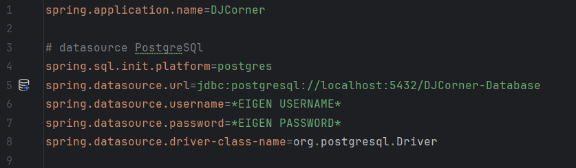

# Inleiding
Deze installatiehandleiding is geschreven voor de backend van de eindopdracht voor de NOVI Full Stack Developer leerlijn. De backend van deze applicatie is ontwikkeld met Spring Boot en vormt de ruggengraat van het platform. Deze REST API maakt het mogelijk om muziekdemo’s te beheren, gebruikers te authentiseren/autoriseren en feedback te verwerken en bijhouden. Deze backend is ontworpen om te integreren met een React gebaseerde frontend.

De kernfunctie voor deze applicatie zijn:
-	Het aanmaken van een account en daarmee kunnen inloggen
-	Inzendingen kunnen maken en deze terug kunnen zien op een dashboard
-	Alle inzendingen kunnen zien en hierop feedback kunnen geven
-	Inzendingen kunnen filteren op basis van tags of status

# Lijst van benodigdheden
Om deze applicatie goed te laten werken heb je het volgende nodig:
-	IntelliJ IDEA v2024.3.4 of hoger.
-	PGAdmin 4 met PostgresSQL 17
-	Postman of de Frontend van dit project

## Framework en dependancies

| Framework/Dependancy           | Beschijving                                                                             |
|--------------------------------|-----------------------------------------------------------------------------------------|
| Maven                          | Dependancy manager en build tool voor de applicatie                                     |
| Spring Boot                    | Framework van de applicatie                                                             |
| spring-boot-starter-web        | Voor het bouwen van RESTful API’s                                                       |
| spring-boot-starter-data-jpa   | Voor database interacties via JPA                                                       |
| spring-boot-starter-validation | Voor het valideren van input met annotaties in de models van de app                     |
| spring-boot-starter-security   | Voor authenticatie en autorisatie van gebruikers                                        |
| spring-boot-starter-test       | Bevat tools voor de unit-en integratietesten van de app (JUnit, Mockito en spring test) |
| spring-security-test           | Voor het testen van beveiligde endpoints en gebruikersrollen                            |
| PostgreSQL Driver              | Gebruikt om verbinding te maken met de PostgreSQL database                              |
| H2 Database                    | Voor het opzetten van een test-database voor de integratietesten                        |
| Java JWT                       | Voor het genereren, parsen en verifiëren van JWT-tokens voor authenticatie              |

# Applicatie installeren
### Stap 1
Open IntelliJ en open het project via een gedownloaden versie door naar het menu linksboven te gaan en op **‘open’** te klikken. Je moet dan even zoeken naar waar je het project hebt opgeslagen

Je kan het project ook openen via version control door naar hetzelfde menu linksboven te gaan en op **‘New > Project from Version Control’**. In het vak **‘URL’** vul je deze link in:

https://github.com/DanielSeton/Fullstack-EindopdrachtBackend-DanielSeton

### Stap 2
Als je nog geen SDK hebt geinstalleerd, komt er een balk aan de bovenkant van je scherm. Helemaal aan de rechterkant kun je op **‘Install SDK’** klikken en hier **‘Oracle OpenJDK’** installeren. De versie van het project is 21, maar 24 werkt ook.

### Stap 3
Als het project is geladen, navigeer naar de **‘Maven’** knop aan de rechterkant van het scherm. Klik op deze knop en ga naar de knop helemaal aan de linkerkant van dit venster. Klik op de knop en klik op **‘Sync Maven’**.

### Stap 4
Open pgAdmin en maak een nieuwe database aan door met de rechtermuisknop te klikken op **'PostgreSQL 17'** in het linker venster en te kiezen voor **‘Create > Database’**.

### Stap 5
Geef de database de naam **“DJCorner-database”** en verander de owner naar **“postgres”** als deze er nog niet staat.

### Stap 6
Open IntelliJ en open de **'application.properties'** in de folder **‘src > main > resources’**.

Vul je eigen username en password in:

*Als je een andere naam hebt gebruikt voor je server, moet je die ook hier invullen**

### Stap 7
Wanneer je nu de applicatie opstart, zou de database gevuld moeten zijn met nieuwe tabellen. Voor de zekerheid, open je nieuwe database en ga naar **‘Schemas’** en klik er op met je rechtermuisknop en klik hierna op **‘Refresh’**.

In **‘Schemas > Public’** is een tab genaamd **‘Tables’**. Als alles goed is opgezet en werkt, zul je hier de tabellen voor de applicatie vinden.

### Stap 8
Het project is nu draaiend en kan via Postman of de Frontend kant van dit project worden gebruikt.

# Inloggegevens
Om gebruik te kunnen maken van de applicatie worden er inloggegevens gebruikt van bestaande gebruikers. Deze gegevens zijn ook al verwerkt in de Postman collecties die bij dit project zijn inbegrepen.

| Gebruikersnaam | Wachtwoord      | Rol          |
|----------------|-----------------|--------------|
| testuser       | 	password       | 	ROLE_USER   |
| teststaff      | 	staffpassword  | 	ROLE_STAFF  |
| testadmin      | 	adminpassword  | 	ROLE_ADMIN  |

## Rollen en autorisatie

| Rol         | Toelichting                                                                                                                                                                                                                     |
|-------------|---------------------------------------------------------------------------------------------------------------------------------------------------------------------------------------------------------------------------------|
| ROLE_USER   | De USER rol kan maar bij een beperkt aantal endpoints. Ze hebben op sommige endpoints (zoals playlists) alleen toegang tot de GET-request. Wel hebben USERS een exclusief PUT en PATCH endpoint om hun submissions aan te passen. |
| ROLE_STAFF  | De STAFF rol heeft meer toegang tot de API dan de USER, maar kan niet bij alle endpoints komen. Zo kunnen STAFF geen users deleten, bijvoorbeeld.                                                                               |
| ROLE_ADMIN  | De ADMIN rol kan alle endpoints met bijbehorende requests bereiken.                                                                                                                                                             |

# Unit-en Integratietesten
Voor deze testen heb je geen extra tools of autorisatie nodig.

### Stap 1
Om alle testen in een keer te runnen ga je naar de test folder die staat in **‘src > test > java’** en klik op de **‘java’** folder met je rechtermuis knop.

### Stap 2
Ga nu naar **‘More Run/Debug > Run ‘All Tests’ with Coverage’** en klik.

### Stap 3
Wacht tot de testen klaar zijn en je zult een nieuw venster aan de rechterkant van je scherm hebben met de line coverage.

